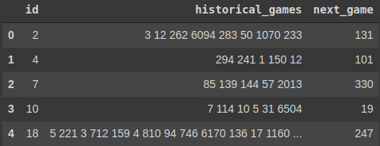

# Recommender-System-using-Colaborative-Filtering
In this project I have used **Bayesian Personilized Ranking (BPR)** for recommendation of new games to users based on their previous activity. The data at hand is like the following.

This data shows the label encoded games a user has installed in order in which, they have installed it (in <code> historical games</code> column) as well as the next game they have installed next (in <code>next_game</code> column). The objective is thus, to predict <code>next_game</code> as accurately as possible for each user. The metric used is hit rate in the top 5 recommended games.

## Recommendation Systems:
Broadly speaking recommendation systems can be classified into two categories:
- **Collaborative Filtering**
- **Content Based Filtering**

Collaborative Filtering only looks at the behavior of the user in the past and tries to make similar predictions for similar users based on their past action, whereas Content Based Filtering uses more features about the recommended entity (such as genre or year of production for movies) and makes recommendations based on user preferences for product features.

This repository focuses only on **Collaborative filtering**, more specifically I have used **BPR**.
To recommend as accurately as possible BPR incorporates the Bayesian analysis of the problem using the likelihood function for p(i >u j|Θ) and the prior probability for the model parameter p(Θ). p(i >u j|Θ) is the probability of a user u prefering item i over item j.

A more in depth description of this method can be found in this [towards data science](https://towardsdatascience.com/recommender-system-using-bayesian-personalized-ranking-d30e98bba0b9) post. Also the [paper](https://arxiv.org/ftp/arxiv/papers/1205/1205.2618.pdf) and the [repository](https://github.com/microsoft/recommenders/blob/main/examples/02_model_collaborative_filtering/cornac_bpr_deep_dive.ipynb) used are linked here.